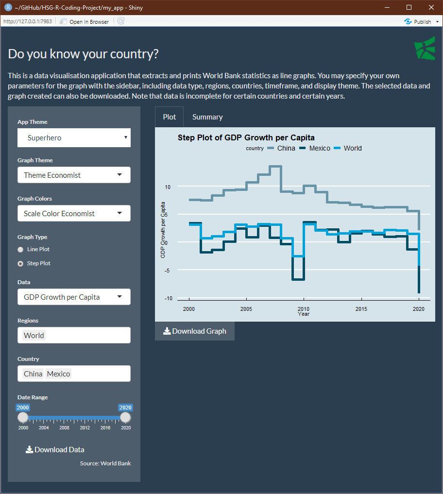

# Background
This repository contains code written in the context of a group project in the course "Coding with Advanced Programming Languages" at the University of St. Gallen in the Spring semester of 2022. The three contributers to this repositories are also the group members of the project.
 
# What does this code accomplish
The code of this repository contains an R shiny project that can be executed to run a local HTML app. The app displays a line plot that contains data by the worldbank on different characteristics for a list of selected countries. The user can change the appearance of the app, set the date range, choose between different variables, select different countries or regions and the user can also download the data or the graph, all by clicking corresponding UI elements.

# How to run this code
First, download the entire repository to your computer. To run the app, you need to have R and RStudio installed on your computer. Once those are installed, you can run the program by opening and executing `runApp.R` with RStudio. To see the source code of the app, navigate to the `my_app` folder and open `app.R`. Alternatively, the app can also be run by opening `app.R` and clicking the `Run App` button in the RStudio interface.

# Code environment
This code checks automatically whether you have installed the necessary packages, so there is no need to find and uncomment any `install.packages()` commands. Thus it should work out of the box for any environment. A CSV list of all the packages used in this project together with their version number are included in this repository. The R version that was used for writing the app is 3.6.1.

# App features
After you successfully opened the app you will see the following:

By clicking on the `App Theme` element, you can change the look of the app. Here we chose the `Superhero` theme:

You can also change the appearance of the plot by using the `Graph Theme` and `Graph Colors` selectors. We changed it to `Economist` from its default `Gdocs`:

Next, we switch from the default line graph to a step graph. Note that the plot title also updates automatically. Use the radio buttons to switch between the two.: 

You can choose between a number of different variables, with the data being provided by World Bank. The default is `GDP Growth per Capita`. Here we changed it to `Unemployment Rate` (note that there can be missing values depending on your selection). Note that the plot title also updates automatically. :

You can choose to display data aggregated by countries or by regions. By default, we display `World`, `China`, and `Mexico`. Here we change it to `European Union` and `Switzerland` (note that there can be missing values depending on your selection):

Our data goes from 2000 to 2020. If you want, you can change this range to anything you like using the slider element. In our example, we changed it to 2004-2016:

We also give you the option to download the data you selected right onto your computer as a CSV file. For this, click the `Download Data` button. A save-as dialog will open:

In addition, you can also download the plot that is currently displayed in the app as a PNG file. For this, click the `Download Graph` button. A save-as dialog will open:

Finally, if you click on `Summary` in the middle of the app next to `Plot` you get a few summary statistics about the data you have chosen:

These are all the features of our app.

# Disclaimer
This code was used for non-commercial research purposes only.
